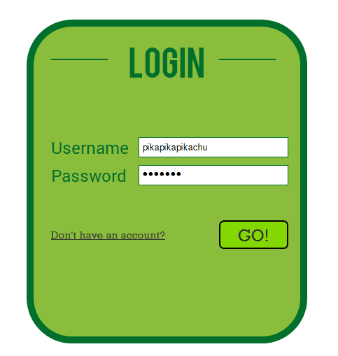
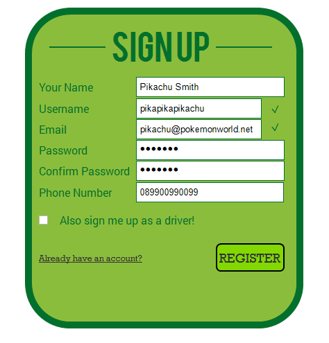
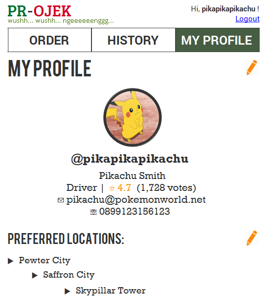
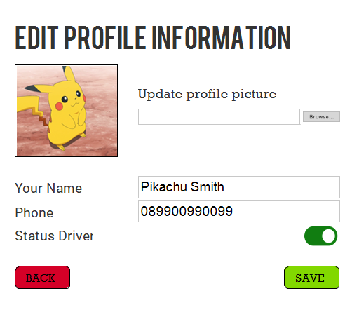
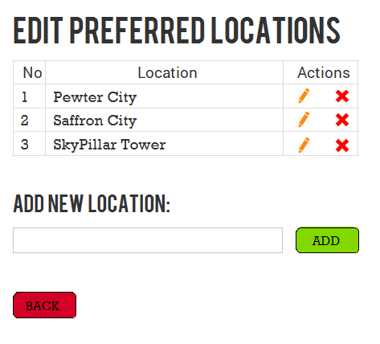
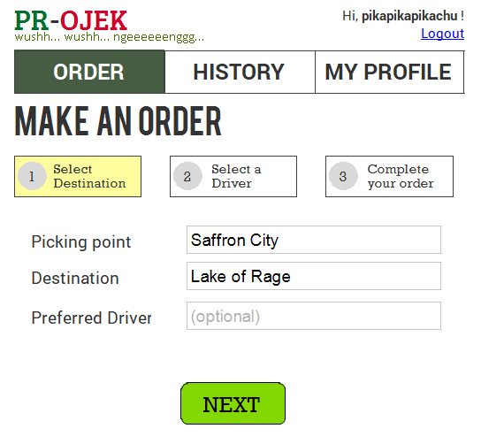
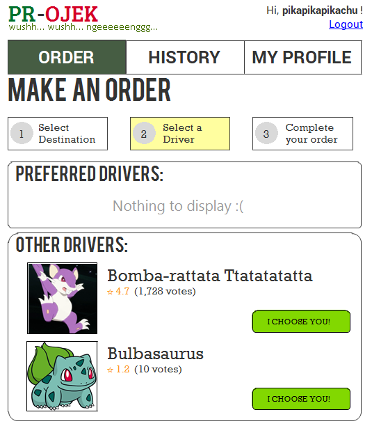
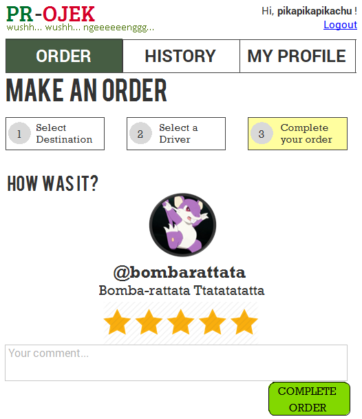
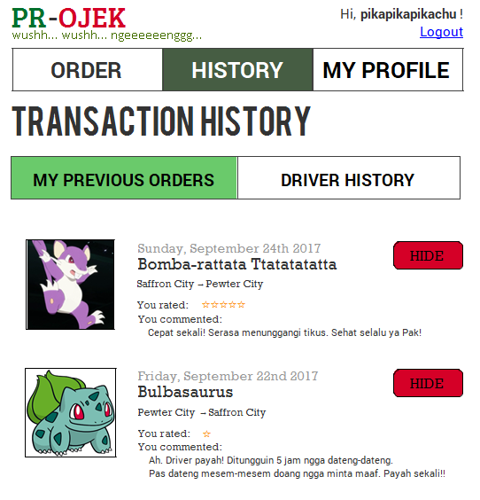
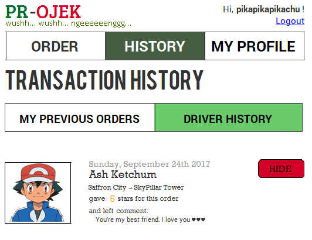

# Tugas 1 IF3110 Pengembangan Aplikasi Berbasis Web

Membuat sebuah Website Ojek Online

## Deskripsi Singkat

Pada tugas besar ini, kami diminta untuk membuat aplikasi *ojek online* **berbasis web** yang memungkinkan seorang pengguna untuk menjadi penumpang dan/atau driver ojek online. Untuk menggunakan aplikasi ini, seorang pengguna harus melakukan login. Pengguna dapat menjadi penumpang maupun driver pada akun yang sama. Untuk menjadi driver, pengguna harus mengaktifkan opsi menjadi driver pada profilnya.

kami diminta untuk membuat tampilan sedemikian hingga mirip dengan tampilan pada contoh. Website yang diminta tidak responsive. Desain tampilan tidak perlu dibuat indah. Icon dan jenis font tidak harus sama dengan contoh. Warna font, garis pemisah, dan perbedaan ukuran font harus terlihat sesuai contoh. Format rating dan waktu harus terlihat sesuai contoh. Perhatikan juga **tata letak** elemen-elemen.

## Anggota Tim

1. 13515031 - Vigor Akbar
2. 13515127 - Fildah Ananda Amalia
3. 13515130 - Adya Naufal Fikri
4. 13515139 - Jehian Norman Saviero
 
## Fungsionalitas Website

1. Web mampu membuat akun yang nanti akan digunakan untuk melakukan transaksi.
2. Web mampu mengecek status akun dari pengguna.
3. User terdaftar dapat melakukan order.
4. Semua user terdaftar dapat mengecek history transaksi.
5. Semua driver terdaftar bisa mengedit preferred location untuk mengambil order.
6. User dapat memberikan rating kepada driver.

## Spesifikasi

### Login

Pengguna dapat melakukan login sebagai user. Login hanya membandingkan username dan password saja, dan tidak perlu proteksi apapun. Halaman ini merupakan halaman pertama yang dibuka oleh pengguna ketika menjalankan aplikasi. Tidak ada proses otentikasi apakah pengguna sudah login atau belum dalam page lainnya. Identitas pengguna yang sedang login diberikan melalui HTTP GET pada URL (sebagai contoh: /profile.php?id_active=2 menkamikan bahwa pengguna yang sedang login memiliki id pengguna = 2).

### Register

Pengguna dapat mendaftarkan diri sebagai user agar dapat menggunakan aplikasi ini. Satu user akan memiliki satu akun yang dapat digunakan sebagai penumpang maupun sebagai driver. User disediakan opsi untuk memilih apakah dia mau menjadi driver atau tidak saat registrasi. kami harus melakukan validasi bahwa email dan username yang sama tidak boleh digunakan untuk dua kali mendaftar. **Validasi email dan username dilakukan menggunakan AJAX**. Jika email dan username valid akan ditkamii dengan lambang centang seperti pada gambar. Setelah selesai register, jika pengguna tidak memilih opsi untuk menjadi driver, pengguna otomatis masuk ke halaman Order dengan keadaan sudah login. Jika pengguna memilih opsi menjadi driver, pengguna otomatis masuk ke halaman Profile dengan keadaan sudah login.

### Profile

Pada halaman ini, ditampilkan username, nama lengkap, email, dan nomor HP. Selain itu, ditampilkan keterangan apakah pengguna merupakan driver atau bukan. Jika pengguna merupakan driver, ditampilkan tulisan Driver diikuti rating dan jumlah vote seperti terlihat pada gambar. Jika pengguna bukan driver, ditampilkan tulisan Non-Driver, tanpa diikuti rating. Pada bagian kanan atas, terdapat tombol edit, jika pengguna menekan tombol tersebut, pengguna dibawa ke halaman Edit-Profile.

Pada bagian bawah, terdapat Preferred Location, yang berisi daftar lokasi yang dilayani pengguna jika berperan sebagai driver. Bagian ini ditampilkan jika pengguna merupakan driver. Pada bagian kanan atas, terdapat tombol edit, jika pengguna menekan tombol tersebut, pengguna dibawa ke halaman Edit-Preferred-Location.

### Edit-Profile

Pada halaman ini, pengguna dapat mengedit nama yang ditampilkan, nomor telepon, foto, dan status driver.

Status driver berupa tombol Yes/No yang dapat diklik oleh pengguna untuk mengganti. Tombol Yes/No dapat berupa sekedar tulisan Yes dan No yang berubah saat ditekan. Pada saat tombol Yes/No ditekan, page tidak boleh refresh. Tulisan Yes dan No harus berbeda warna.

**Bonus** Tombol Yes/No diimplementasikan seperti pada gambar, berupa semacam toggle yang akan berubah bentuk dan warna saat ditekan. Tombol Yes/No tersebut harus diimplementasikan dengan HTML dan CSS, **tidak boleh menggunakan image**.

Pada bagian bawah halaman, terdapat tombol Back dan Save. Jika tombol Back ditekan, pengguna kembali ke halaman Profile. Jika tombol tersebut ditekan, nama dan nomor telepon pengguna akan diganti sesuai input field. Setelah tombol save ditekan, pengguna dibawa ke halaman Profile.

### Edit-Preferred-Location

Pada Edit-Preferred-Location, ditampilkan lokasi-lokasi yang dapat dicapai jika menjadi driver. Pada tiap baris lokasi, ada tombol Delete. Jika tombol tersebut ditekan, akan tampil konfirmasi untuk delete, menggunakan Javascript. Setelah Delete, halaman akan refresh.

Pada bagian Add New Location, terdapat sebuah text area dan sebuah tombol Add. Pada text area, pengguna dapat mengisikan lokasi untuk ditambahkan. Ketika tombol Add ditekan, alamat tersebut ditambahkan pada preferred location pengguna, dan halaman refresh.

Jika tombol Back ditekan, pengguna dibawa kembali ke halaman Profile.

Catatan: Format alamat dibebaskan kepada mahasiswa.

**Bonus** Implementasikan edit preferred location, ketika tombol edit ditekan, cell yang bersangkutan berubah menjadi input field dan dapat diedit, dan tombol edit berubah menjadi tombol save. Jika tombol save ditekan, data diupdate dan halaman refresh.

### Order-Ojek

Order-Ojek merupakan halaman utama yang ditampilkan ketika user telah login. Pada halaman Order-Ojek, terdapat sebuah form yang dapat diisi pengguna untuk melakukan order.

Perlu diperhatikan, tulisan di atas tombol logout memiliki format "Hi, username!". Selanjutnya, terdapat menu bar yang menampilkan 3 menu utama seperti pada gambar. Menu yang sedang dibuka diberikan warna background yang berbeda sebagai penkami halaman apa yang sedang dibuka pengguna.

Setelah pengguna mengisi field-field pada form order dan menekan tombol order, pengguna akan dibawa ke halaman Select-Driver. Perlu diperhatikan bahwa seluruh field wajib diisi, kecuali field "Preferred Driver". Pada field Preferred Driver, terdapat Placeholder "(optional)"

### Select-Driver

Pada halaman ini, ditampilkan driver-driver yang tersedia dan dapat mengambil order. Driver yang dapat mengambil order adalah pengguna yang menjadi driver, dan memiliki alamat asal *atau* alamat tujuan pada "Preferred Location"-nya.

Halaman ini terdiri atas dua bagian, yaitu "Preferred Driver" dan "Other Drivers". Bagian "Preferred Driver" akan terisi dengan driver-driver dengan nama yang diisikan pengguna pada field "Preferred Driver" saat melakukan order. Jika pengguna tidak mengisikan field "Preferred Driver" atau tidak ada driver dengan nama yang diisikan pada field "Preferred Driver", bagian Preferred Driver akan kosong.

Pada bagian "Other Drivers", ditampilkan seluruh driver yang dapat mengambil order tersebut.

Perlu diperhatikan, pada setiap driver, terdapat foto, nama, dan rating driver tersebut. Rating dituliskan dengan format: Rating rata-rata (jumlah orang yang memberikan rating).

Setelah memilih driver dan menekan tombol Confirm, pengguna dibawa ke halaman Complete-Order.

### Complete-Order

Pada halaman Complete-Order, akan ditampilkan informasi driver dan order, serta opsi untuk memberikan rating dan komentar. Setelah pengguna submit rating dan komentar untuk driver, pengguna dibawa ke halaman Order-Ojek.

Rating untuk driver berupa integer antara 1 sampai 5 (inklusif). Implementasi rating dibebaskan pada peserta.

**Bonus** Implementasikan rating sesuai gambar.

### History

Pada halaman history, terdapat dua tab, yaitu History Penumpang dan History Driver. History Penumpang menampilkan daftar order yang pernah diambil pengguna sebagai penumpang, dan History Driver menampilkan daftar order yang pernah diambil pengguna sebagai driver.

Pada tiap entri pada history, terdapat tombol hide. Jika tombol hide ditekan, history yang bersangkutan tidak akan ditampilkan, tapi tidak dihapus.

### Pembagian Tugas

**Tampilan**
1. Login : 13515130
2. Register : 13515130
3. My Previous Order : 13515127
4. Validasi-Identitas pengorder : 13515031
5. Validasi-Login : 13515130
6. Validasi-Destinasi : 13515139
7. Select Driver : 13515139
8. Complete Order : 13515031,13515139
9. Driver History : 13515127
10. Edit Profile : 13515130
11. Edit Preferred Location : 13515130

**Fungsionalitas**
1. Login : 13515130
2. Register : 13515130
3. My Previous Order : 13515127
4. Select Driver : 13515139
5. Complete Order : 13515031,13515139
6. Driver History : 13515127
7. Edit Profile : 13515130
8. Edit Preferred Location : 13515130
9. Database : 13515130,13515139
